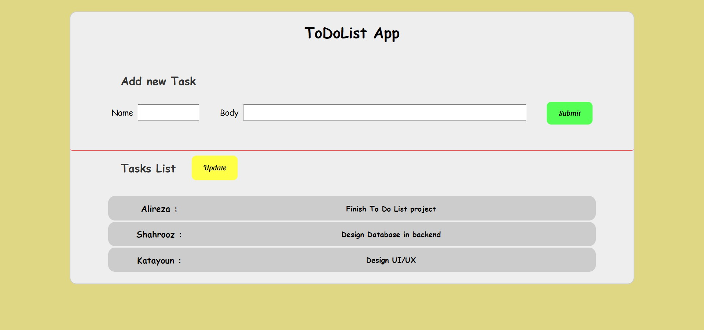

# TODOLIST App

#### ToDoList app is made by React js.

---

### This app has some usable UI that includes `Button.js`, `Card.js`, `Input.js` and `Task.js`. These are available in `ui/` folder.

&nbsp;

---

### It uses `Context/` to manage Data. TaskList, GetAllTasks and CreateNewTask are in `TaskHook.js` file. These files are shared to other files which may need them.

## Data Will saves and keeps in DB by backend.

### Also this app uses following hooks:

- useState
- useEffect
- useRef
- useContext

&nbsp;

---

### The app just made by two main component where placed in `component/` folder which called `DisplayList.js` and `EnterToDo.js`.

&nbsp;

---

### All request will send to backend by `fetch`. It uses both `GET` and `POST` request in this app.

&nbsp;

---

#### In First View we'll see this structure:



&nbsp;

---

## How to run:

&nbsp;

### 1. First enter the main folder:

```
cd todolist
```

&nbsp;

### 2. Then install `node modules` folder:

```
npm install
```

&nbsp;

### 3. Finally run the app by this command:

```
npm start
```

&nbsp;

---

**_I Will be So happy if you give me feedback by this project :)_**
